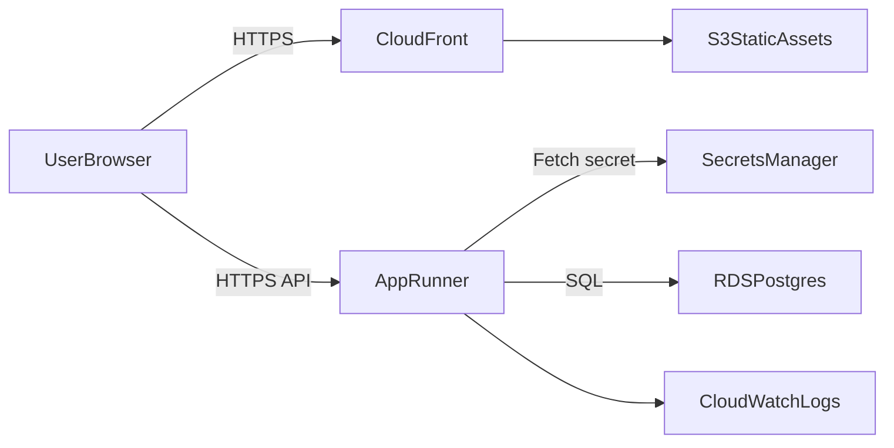

# Architecture

## Overview

The system is a split frontend/backend architecture:
- Frontend: Vue static assets served via S3 + CloudFront.
- Backend: containerized Express API on App Runner.
- Data: PostgreSQL on Amazon RDS.
- Secrets: `DATABASE_URL` stored in AWS Secrets Manager.

## Diagram

## Key decisions

- **Layered API**: `routes -> controllers -> services -> repositories` for separation of concerns and testability.
- **DTO validation**: request schemas are isolated from persistence models and validated with Zod.
- **Error standardization**: all errors use `{ code, message, details }`.
- **MVP security**: write routes are protected with `X-API-Key` and can be upgraded to JWT/Cognito later.
- **Cloud readiness**: env-only config, graceful shutdown, multi-stage Docker build, and structured logs with request-id.

## Trade-offs

- API key is intentionally minimal and simple for MVP; stronger auth should migrate to Cognito/JWT.
- Frontend deploy and backend deploy are orchestrated in CI using infra outputs to keep delivery reproducible.
